# DebonAIr - Fashion AI Architecture Overview

## High-Level System Architecture

```mermaid
graph TB
    subgraph Frontend["🖥️ FRONTEND LAYER"]
        UI[User Interface<br/>HTML/CSS/JavaScript]
        Upload[Image Upload System<br/>Drag & Drop, HEIC Support]
        RT[Real-time Updates<br/>Socket.IO, Progress Tracking]
        Visual[Visual Experience<br/>Magnify, Carousel]
    end

    subgraph Backend["⚙️ BACKEND LAYER - Flask Application"]
        API[API Endpoints<br/>POST /api/generate<br/>GET /api/weather]
        Session[Session Manager<br/>60min conversation history]
        Query[Query Handler<br/>Intent detection]
        ImgProc[Image Processor<br/>HEIC→JPEG, Validation]
        Weather[Weather Service<br/>IP Geolocation + Open-Meteo]
    end

    subgraph AI["🤖 AI/ML PROCESSING LAYER"]
        direction LR
        subgraph GradientAI["DigitalOcean Gradient AI"]
            Gradient[llama3.3-70b-instruct<br/>Fashion Expert Agent]
            GradInput[INPUT:<br/>• Wardrobe descriptions<br/>• Person profile<br/>• Weather context<br/>• User instructions]
            GradOutput[OUTPUT:<br/>• 1-12 outfit combos<br/>• Style reasoning<br/>• Wearing instructions<br/>• Fashion advice]
        end

        subgraph GeminiAI["Google Gemini Vision"]
            Vision[Vision Analysis<br/>gemini-2.0-flash-exp]
            Generation[Image Generation<br/>NanoBanana Model]
            VisionTasks[• Selfie description<br/>• Clothing analysis<br/>• Body type detection<br/>• Color matching]
            GenTasks[• Virtual try-on<br/>• Outfit visualization<br/>• Realistic rendering]
        end
    end

    subgraph External["🌐 EXTERNAL SERVICES"]
        OpenMeteo[Open-Meteo API<br/>Weather data]
        IPApi[ipapi.co<br/>Geolocation]
        Unsplash[Unsplash<br/>Background images]
    end

    UI --> Upload
    Upload --> RT
    RT --> Visual

    Frontend -->|WebSocket + REST| Backend

    Backend --> API
    API --> Session
    API --> Query
    API --> ImgProc
    API --> Weather

    Backend -->|Image Analysis| Vision
    Backend -->|Outfit Selection| Gradient
    Gradient -->|Selected Items| Generation

    Weather --> OpenMeteo
    Weather --> IPApi
    Visual --> Unsplash

    Vision --> VisionTasks
    Generation --> GenTasks
    Gradient --> GradInput
    Gradient --> GradOutput

    Generation -->|12 Outfit Images| Backend
    Backend -->|Real-time Stream| Frontend

    style Frontend fill:#e1f5ff
    style Backend fill:#fff4e1
    style AI fill:#f0e1ff
    style External fill:#e1ffe1
    style Gradient fill:#ff6b9d,color:#fff
    style Vision fill:#0080ff,color:#fff
    style Generation fill:#0080ff,color:#fff
```



## Data Flow Pipeline

```mermaid
flowchart LR
    A[👤 User Uploads<br/>Selfies 0-3<br/>Clothing 0-30<br/>Query text] --> B[🔍 Gemini Vision<br/>Image Analysis]

    B --> C1[Person Description<br/>Body type, style, colors]
    B --> C2[Clothing Descriptions<br/>Item details, colors, type]

    C1 --> D[🌡️ Weather Context<br/>Location + Temp]
    C2 --> D
    A --> D

    D --> E[🤖 Gradient AI Agent<br/>llama3.3-70b-instruct<br/>Fashion Expert]

    E --> F[⚡ Outfit Selection<br/>1-12 combinations<br/>Style reasoning<br/>Wearing instructions]

    F --> G[🎨 Gemini NanoBanana<br/>Image Generation]

    G --> H[✨ 12 Outfit Images<br/>with reasoning]

    H --> I[📡 Real-time Delivery<br/>Socket.IO streaming<br/>Live preview]

    I --> J[👁️ User Views<br/>Magnification<br/>Chat interface]

    style A fill:#e1f5ff
    style B fill:#0080ff,color:#fff
    style E fill:#ff6b9d,color:#fff
    style G fill:#0080ff,color:#fff
    style I fill:#00d084,color:#fff
    style J fill:#e1f5ff
```



## Component Architecture

```mermaid
graph TB
    subgraph Client["CLIENT SIDE"]
        direction TB
        UI1[app.js - Main Application Logic]
        UI2[Session State Management]
        UI3[WebSocket Connection]
        UI4[Image Upload & Preview]
        UI5[Progress Tracking]
        UI6[Card Magnification]
    end

    subgraph Server["SERVER SIDE - app.py"]
        direction TB
        Route1[/api/generate - Main endpoint]
        Route2[/api/weather - Weather data]
        Route3[/api/default-wardrobe - Demo]
        WS[Socket.IO Events]
    end

    subgraph Services["SERVICES"]
        direction TB
        S1[gradient_agent.py<br/>Outfit Selection]
        S2[query_handler.py<br/>Intent Detection]
        S3[session_manager.py<br/>Conversation History]
        S4[gemini_vision.py<br/>Image Analysis]
        S5[gemini_generate.py<br/>Outfit Generation]
    end

    subgraph Models["DATA MODELS"]
        direction TB
        M1[ChatSession<br/>ChatMessage]
        M2[UploadedImage]
        M3[OutfitResponse]
        M4[GenerationProgress]
    end

    UI1 --> UI2 & UI3 & UI4 & UI5 & UI6
    Client <--> Server
    Server --> Route1 & Route2 & Route3 & WS
    Route1 --> S1 & S2 & S3 & S4 & S5
    Services --> Models

    style Client fill:#e1f5ff
    style Server fill:#fff4e1
    style Services fill:#f0e1ff
    style Models fill:#e1ffe1
```

## Key Features & Capabilities

### 🎨 Smart Styling
- **Mix & Match**: Combine selfie items with wardrobe pieces
- **Color Coordination**: AI-powered color matching
- **Occasion-Based**: Outfits for different events and weather
- **Body Type Aware**: Personalized recommendations

### 💬 Conversational AI
- **Session Memory**: 60-minute conversation history
- **Question Answering**: Ask about outfits and style
- **Style Guidance**: Expert fashion advice
- **Follow-up Queries**: Contextual understanding

### 🌡️ Weather-Aware
- **Real-time Data**: Current temperature and conditions
- **Location-Based**: GPS + IP geolocation
- **Weather-Appropriate**: Seasonal styling advice
- **Dynamic Recommendations**: Adapts to weather changes

### 🖼️ Visual Experience
- **Image Magnification**: Click to enlarge outfits
- **Sliding Carousel**: Background model photos
- **Responsive Design**: Works on all devices
- **Smooth Animations**: Polished UI/UX

### ⚡ Real-Time Updates
- **Live Preview**: Outfits appear as they're generated
- **Progress Tracking**: Visual feedback during generation
- **WebSocket Streaming**: Instant updates
- **Parallel Generation**: Fast processing

### 🎯 Demo Mode
- **Default Wardrobe**: 30 pre-loaded clothing items
- **Drag & Drop Upload**: Easy file management
- **HEIC Auto-Conversion**: iPhone image support
- **Pre-built Examples**: Quick demonstrations

## Technical Stack

### Frontend
- **Vanilla JavaScript** - No framework overhead
- **HTML5/CSS3** - Modern web standards
- **Socket.IO Client** - Real-time communication
- **Responsive Design** - Mobile-friendly

### Backend
- **Flask 3.0** - Python web framework
- **Flask-SocketIO** - WebSocket support
- **Python 3.11+** - Latest language features
- **Pydantic Validation** - Type-safe data models
- **Session Management** - In-memory conversation tracking

### AI/ML
- **DigitalOcean Gradient AI** - Agent orchestration
- **llama3.3-70b-instruct** - Fashion expert LLM
- **Google Gemini 2.0** - Vision + generation
- **NanoBanana Model** - Virtual try-on

### External APIs
- **Open-Meteo** - Weather forecasting
- **ipapi.co** - IP geolocation
- **Unsplash** - Background imagery

### Deployment
- **Flask Development Server** - Development mode
- **WebSocket Support** - Real-time capabilities
- **Environment Variables** - Configuration management
- **Session Management** - User state tracking

## File Structure

```
DebonAIr/
├── app.py                    # Main Flask application
├── services/
│   ├── gradient_agent.py     # Outfit selection with Gradient AI
│   ├── query_handler.py      # Intent detection and routing
│   ├── session_manager.py    # Conversation history management
│   ├── gemini_vision.py      # Image analysis
│   └── gemini_generate.py    # Outfit image generation
├── models/
│   └── schemas.py            # Pydantic data models
├── templates/
│   └── index.html            # Main UI template
├── static/
│   ├── css/style.css         # Application styling
│   └── js/app.js             # Frontend application logic
├── clothing/                 # Default wardrobe images
├── unsplash/                 # Background carousel images
└── output/                   # Generated outfit images
```

## API Endpoints

### POST /api/generate
Main endpoint for outfit generation
- **Inputs**: Selfie images, clothing images, text query, session ID
- **Outputs**: 1-12 outfit images with reasoning and wearing instructions
- **Features**: Real-time progress updates via WebSocket

### GET /api/weather
Weather data for styling recommendations
- **Outputs**: Temperature, location, weather conditions
- **Features**: GPS/IP-based geolocation

### GET /api/default-wardrobe
Demo wardrobe for quick testing
- **Outputs**: 30 random clothing item filenames
- **Features**: Enables demo mode without uploads

### GET /output/<filename>
Serve generated outfit images

### GET /clothing/<filename>
Serve default wardrobe images

### GET /unsplash/<filename>
Serve background carousel images
